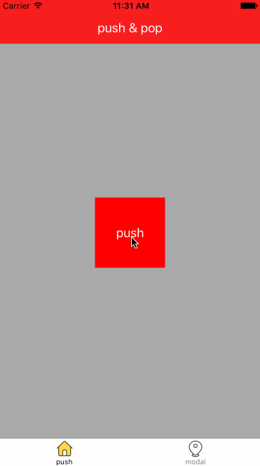
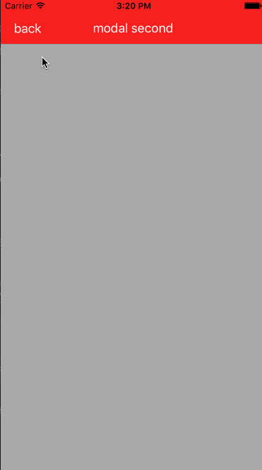

# TransitionStudyDemo
##触发转场的方式
目前为止，官方支持以下几种方式的自定义转场：

* 在 `UINavigationController` 中 `push` 和 `pop`;
* Modal 转场：`presentation` 和 `dismissal`，俗称视图控制器的模态显示和消失，仅限于`modalPresentationStyle`属性为 `UIModalPresentationFullScreen` 或 `UIModalPresentationCustom` 这两种模式;
* 在 `UITabBarController` 中切换 Tab;
* `UICollectionViewController` 的布局转场：仅限于 `UICollectionViewController` 与 `UINavigationController` 结合的转场方式，与上面三种都有点不同，不过实现很简单

##转场概述
###1. 转场代理:
自定义转场的第一步便是提供转场代理，告诉系统使用我们提供的代理而不是系统的默认代理来执行转场。有如下三种转场代理，对应上面三种类型的转场：

```object-c
<UINavigationControllerDelegate> //UINavigationController 的 delegate 属性遵守该协议。
<UITabBarControllerDelegate> //UITabBarController 的 delegate 属性遵守该协议。
<UIViewControllerTransitioningDelegate> //UIViewController 的 transitioningDelegate 属性遵守该协议。
```
这里除了`<UIViewControllerTransitioningDelegate>`是 iOS 7 新增的协议，其他两种在 iOS 2 里就存在了，在 iOS 7 时扩充了这两种协议来支持自定义转场。

转场发生时，UIKit 将要求转场代理将提供转场动画的核心构件：动画控制器和交互控制器(可选的)；由我们实现。

###2. 动画控制器(Animation Controller)：
最重要的部分，负责添加视图以及执行动画；遵守`<UIViewControllerAnimatedTransitioning>`协议；由我们实现。

###3. 交互控制器(Interaction Controller)：
通过交互手段，通常是手势来驱动动画控制器实现的动画，使得用户能够控制整个过程；遵守`<UIViewControllerInteractiveTransitioning>`协议；系统已经打包好现成的类供我们使用。

###4. 转场环境(Transition Context):
提供转场中需要的数据；遵守`<UIViewControllerContextTransitioning>`协议；由 UIKit 在转场开始前生成并提供给我们提交的动画控制器和交互控制器使用。

###5. 转场协调器(Transition Coordinator)：
可在转场动画发生的同时并行执行其他的动画，其作用与其说协调不如说辅助，主要在 Modal 转场和交互转场取消时使用，其他时候很少用到；遵守`<UIViewControllerTransitionCoordinator>`协议；由 UIKit 在转场时生成，`UIViewController` 在 iOS 7 中新增了方法`transitionCoordinator()`返回一个遵守该协议的对象，且该方法只在该控制器处于转场过程中才返回一个此类对象，不参与转场时返回 `nil`。

###总结下:
> 5个协议只需要我们操心3个；实现一个最低限度可用的转场动画，我们只需要提供上面五个组件里的两个：转场代理和动画控制器即可，还有一个转场环境是必需的，不过这由系统提供；当进一步实现交互转场时，还需要我们提供交互控制器，也有现成的类供我们使用。

##demo1:UINavigationController转场（非交互）



###1. 转场代理实现:
```object-c
@interface NavigationInteractiveTransition : NSObject<UINavigationControllerDelegate>
```

```object-c
- (id<UIViewControllerAnimatedTransitioning>)navigationController:(UINavigationController *)navigationController
                                  animationControllerForOperation:(UINavigationControllerOperation)operation
                                               fromViewController:(UIViewController *)fromVC
                                                 toViewController:(UIViewController *)toVC {
    /**
     *  方法1中判断如果当前执行的是Pop操作，就返回我们自定义的Pop动画对象。
     */
    if (operation == UINavigationControllerOperationPop){
        return [[PopAnimation alloc] init];
    }
    else{
        return [PushAnimation new];
    }
    
    return nil;
}

```
从上面的代码可以看出，我们可以根据不同的 `operation`（Push 或 Pop）返回不同的 `animator`。我们可以把 `animator` 存到一个属性中，从而在多个 `operation` 之间实现共享，或者我们也可以为每个 `operation` 都创建一个新的 `animator` 对象，这里的灵活性很大。

###2. 动画控制器实现:
```object-c
@interface PopAnimation : NSObject<UIViewControllerAnimatedTransitioning>
```
这个协议要求我们实现两个方法，其中一个定义了动画的持续时间：

```
- (NSTimeInterval)transitionDuration:(id <UIViewControllerContextTransitioning>)transitionContext {
    //这个方法返回动画执行的时间
    return 0.3;
}
```
另一个方法描述整个动画的执行效果：

```
/**
 *  transitionContext你可以看作是一个工具，用来获取一系列动画执行相关的对象，并且通知系统动画是否完成等功能。
 */
- (void)animateTransition:(id <UIViewControllerContextTransitioning>)transitionContext {
    /**
     *  获取动画来自的那个控制器
     */
    UIViewController *fromViewController = [transitionContext viewControllerForKey:UITransitionContextFromViewControllerKey];
    /**
     *  获取转场到的那个控制器
     */
    UIViewController *toViewController = [transitionContext viewControllerForKey:UITransitionContextToViewControllerKey];
    
    UIView *fromView = nil;
    UIView *toView = nil;
    
    if( [transitionContext respondsToSelector:@selector(viewForKey:)] ){
        fromView = [transitionContext viewForKey:UITransitionContextFromViewKey];
        toView = [transitionContext viewForKey:UITransitionContextToViewKey];
    }
    else{
        fromView = fromViewController.view;
        toView = toViewController.view;
    }
    
    /**
     *  转场动画是两个控制器视图时间的动画，需要一个containerView来作为一个“舞台”，让动画执行。
     */
    UIView *containerView = [transitionContext containerView];
    // ❗️1.
    [containerView insertSubview:toView belowSubview:fromView];
    
    NSTimeInterval duration = [self transitionDuration:transitionContext];
    
    // tofromvc
    CGAffineTransform transf = CGAffineTransformIdentity;
    toView.transform = CGAffineTransformScale(transf, 0.94, 0.94);
    
    /**
     *  执行动画，我们让fromVC的视图移动到屏幕最右侧
     */
    [UIView animateWithDuration:duration animations:^{
        toView.transform = CGAffineTransformIdentity;
        
        fromView.transform = CGAffineTransformMakeTranslation([UIScreen mainScreen].bounds.size.width, 0);
    }completion:^(BOOL finished) {
        // 转场结束后，恢复视图状态
        toView.layer.transform = CATransform3DIdentity;
        /**
         *  当你的动画执行完成，这个方法必须要调用，否则系统会认为你的其余任何操作都在动画执行过程中。
         */
        // ❗️2.
        [transitionContext completeTransition:!transitionContext.transitionWasCancelled];
    }];
}
```
**注意上面的代码有2处标记，是动画控制器必须完成的：**
1. 将 `toView` 添加到容器视图中，使得 `toView` 在屏幕上显示( `Modal` 转场中此点稍有不同，下一节细述)，也不必非得是`addSubview:`，某些场合你可能需要调整 `fromView` 和 `toView` 的显示顺序，总之将之加入到 `containerView` 里就行了；
2. 动画结束后正确地结束转场过程。转场的结果有两种：完成或取消。非交互转场的结果只有完成一种情况，不过交互式转场需要考虑取消的情况。如何结束取决于转场的进度，通过`transitionWasCancelled()`方法来获取转场的结果，然后使用`completeTransition:`来通知系统转场过程结束，这个方法会检查动画控制器是否实现了`animationEnded`:方法，如果有，则调用该方法。

最后：
转场结束后，`fromView` 会从视图结构中移除，`UIKit` 自动替我们做了这事，你也可以手动处理提前将 `fromView` 移除，这完全取决于你。虽然这个动画控制器实现的动画非常简单，但此刻我们已经替换掉了系统提供的默认转场动画。

##demo2: modal转场



> 注意：容器类 VC 的转场里 `fromView` 和 `toView` 是 `containerView` 的子层次的视图，而 Modal 转场里 `presentingView(fromView)` 与 `containerView` 是同层次的视图，只有 `presentedView(toView)` 是 `containerView` 的子层次视图。

**重要：**
这种视图结构上的差异与 Modal 转场的另外一个不同点是相契合的：转场结束后 `fromView` 可能依然可见，比如 `UIModalPresentationPageSheet` 模式的 `Modal` 转场就是这样。容器 VC 的转场结束后 `fromView` 会被主动移出视图结构，这是可预见的结果，我们也可以在转场结束前手动移除；而 Modal 转场中，`presentation` 结束后 `presentingView(fromView)` 并未主动被从视图结构中移除。准确来说，在我们可自定义的两种模式里，`UIModalPresentationCustom` 模式(以下简称 Custom 模式)下 Modal 转场结束时 `fromView` 并未从视图结构中移除；`UIModalPresentationFullScreen` 模式(以下简称 FullScreen 模式)的 Modal 转场结束后 `fromView` 依然主动被从视图结构中移除了。这种差异导致在处理 `dismissal` 转场的时候很容易出现问题，没有意识到这个不同点的话出错时就会毫无头绪。

来看看 dismissal 转场时的场景：

* FullScreen 模式：`presentation` 结束后，`presentingView` 被主动移出视图结构，不过，在 `dismissal` 转场中希望其出现在屏幕上并且在对其添加动画怎么办呢？实际上，你按照容器类 VC 转场里动画控制器里那样做也没有问题，就是将其加入 `containerView` 并添加动画。不用担心，转场结束后，UIKit 会自动将其恢复到原来的位置。虽然背后的机制不一样，但这个模式下的 Modal 转场和容器类 VC 的转场的动画控制器的代码可以通用，你不必记住背后的差异。
* Custom 模式：`presentation` 结束后，`presentingView(fromView)` 未被主动移出视图结构，在 dismissal 中，注意不要像其他转场中那样将 `presentingView(toView)` 加入 `containerView` 中，否则 `dismissal` 结束后本来可见的 `presentingView` 将会随着 `containerView` 一起被移除。如果你在 Custom 模式下没有注意到这点，很容易出现黑屏之类的现象而不知道问题所在.

###1. 转场代理实现:

```
@interface ModalViewController ()<UIViewControllerTransitioningDelegate>

@end
```

```
- (nullable id <UIViewControllerAnimatedTransitioning>)animationControllerForPresentedController:(UIViewController *)presented presentingController:(UIViewController *)presenting sourceController:(UIViewController *)source
{
    return [ModalCardAnimation new];
}

- (nullable id <UIViewControllerAnimatedTransitioning>)animationControllerForDismissedController:(UIViewController *)dismissed
{
    return [ModalCardAnimation new];
}

```


##关于滑动返回
目前大体的滑动返回，分两种方式：一种是系统自带的样式，另一种是类似阿里／京东的全屏滑动返回.

* [RTRootNavigationController](https://github.com/rickytan/RTRootNavigationController)：目前最好的全屏滑动返回解决方案了
	* 实现思路:[用Reveal分析网易云音乐的导航控制器切换效果](http://jerrytian.com/2016/01/07/%E7%94%A8Reveal%E5%88%86%E6%9E%90%E7%BD%91%E6%98%93%E4%BA%91%E9%9F%B3%E4%B9%90%E7%9A%84%E5%AF%BC%E8%88%AA%E6%8E%A7%E5%88%B6%E5%99%A8%E5%88%87%E6%8D%A2%E6%95%88%E6%9E%9C/)

* [FDFullscreenPopGesture](https://github.com/forkingdog/FDFullscreenPopGesture)：一个丝滑的全屏滑动返回手势
* [JZNavigationExtension](https://github.com/JazysYu/JZNavigationExtension)：同上
* [MultiLayerNavigation](https://github.com/vinqon/MultiLayerNavigation):全屏滑动返回;**实现思路:复制页面快照**
	* [iOS页面右滑返回交互实现方案](http://www.vinqon.com/codeblog/?detail/11108)
	


